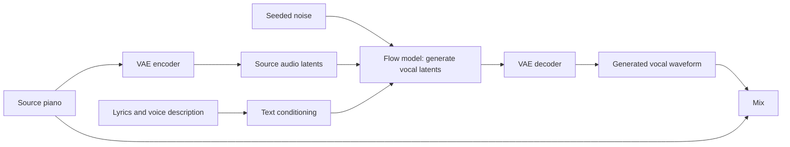

# 005 — Orchestral LEGO and an explicit melody representation

Add orchestral accompaniment to the same Color Purple source used in experiments
003 and 004. Use the original XL-base model, without the Foster adapter, to test
instrumental accompaniment separately from the poorly received continuation runs.

## Listening

- [Piano with strings, woodwinds, and brass](audio/piano-and-orchestra.mp3)
- [Piano with strings only](audio/piano-and-strings.mp3)
- [Generated orchestral additions without the original piano](audio/orchestra-only.mp3)
- Individual stems: [strings](audio/strings.mp3), [woodwinds](audio/woodwinds.mp3),
  [brass](audio/brass.mp3).

Float WAV versions accompany each MP3. Audio is retained as repository content,
following the user's preference. Source copies, raw generations, and runtime logs
remain local and gitignored. All six exports completed on October 5, 2026.

The three LEGO passes took 257.5 seconds including initialization and exports,
with 12.21 GiB peak Torch allocation. Each output is 210.35 seconds, stereo at
48 kHz. Technical checks passed: all stems are finite and non-silent; intermediate
contexts, final mix, and orchestral-only mix reconstruct exactly from their recorded
components. The MIDI compiler's three tests passed. User listening feedback on
October 5, 2026 described the orchestral result as a "mess"; it did not meet the
user's musical-coherence requirement. Technical integrity did not establish a
useful arrangement. Vocal or piano leakage was not separately assessed.

## What is being tested

The user found the previous singing realistic but poorly aligned with the piano,
both long continuations poor, and the Foster adapter's vocal output similar to the
base model. A better Suno result is the user's practical comparison. This experiment
tests whether instrumental support works better; it cannot validate singing alignment.

ACE-Step's documented LEGO interface generates one named instrument family from
existing audio context. The supported families include strings, woodwinds, and
brass; there is no dedicated `orchestra` family. This run builds an arrangement
through three calls:

1. Source piano → generate strings → mix piano and strings.
2. Piano and strings → generate woodwinds → update the mix.
3. Piano, strings, and woodwinds → generate brass → final mix.

Each prompt requests an instrumental stem and supporting musical roles. The
lyrics field is `[Instrumental]`. The model must still demonstrate harmony,
phrasing, instrument separation, and absence of unwanted singing through listening.
Requested instrument labels do not certify the content of generated audio.

| Setting | Value |
|---|---|
| Model | `acestep-v15-xl-base`, no adapter |
| ACE revision | `ca1e85fe9430179831e6bc6be790c332190a3866` |
| Source | `/tmp/theme_from_the_color_purple.mp3`, full recording |
| Task | Three sequential `lego` calls |
| Steps / guidance / seed | 50 / 7 / 20261005 for each family |
| LM planning | Disabled |
| Relative stem RMS | Strings −6 dB, woodwinds −12 dB, brass −14 dB versus source |
| Mixing | Original piano plus scaled generated stems; constant peak-headroom gain |

The source piano is never regenerated or time-stretched. A constant gain may scale
the complete mix. Intermediate context mixes use peak headroom before being fed
back into ACE. Stems are saved at generated amplitude, and mixing gains are recorded.

## How the previous voice was generated

For the actual vocal runs, the source recording was encoded into continuous VAE
latents. The caption and lyrics supplied conditioning embeddings. Starting from
seeded noise, the flow model predicted a vocal latent sequence, then the VAE decoded
it into a waveform. That stem was mixed with the original recording afterward.



The pinned XL-base code concatenates source latents and the time mask into the
decoder's context, then concatenates that context with the noisy target latents.
This is a direct audio-conditioning path. It is not an explicit vocal score or
forced syllable-to-note alignment. The piano can influence the result without
reliable copying of its intended melody. These runs did not isolate the strength
of that influence with an audio-conditioning ablation.

The vocal was newly generated, not a separately retrieved sample. Pitch, rhythm,
voice character, and lyric realization were inferred together. There was no
separate TTS recording followed by a score-constrained pitch-correction stage.

## The user's scale-degree hint

```text
5_ 1 3 6_ 1 4 2 3
5_ 1 3 6_ 1 4 6 5
```

The underscore means an octave below the reference register. With **1 = C4 in
C major**, this resolves to:

```text
G3 C4 E4 A3 C4 F4 D4 E4
G3 C4 E4 A3 C4 F4 A4 G4
```

An explicit demonstration compiles those tokens into inspectable note events:

- [MIDI](melody-demo/melody.mid)
- [Guide audio](melody-demo/melody-guide.mp3)
- [Symbolic events and assumptions](melody-demo/notes.json)
- [Compiler and deterministic synthesizer](record/melody_hint.py)

**Demo assumptions:** C major, 1 = C4, 90 BPM, 4/4, every token one quarter note,
no rests between phrases. These settings illustrate the notation; they were not
inferred from the Color Purple recording. The guide sound is a simple additive
synthesizer, not an ACE output or a sampled piano. The orchestral run uses the
source recording alone as its audio guide; this separate melody demo is not mixed
into it.

A useful representation for the research direction is:

```text
scale-degree notation + tonic/mode + durations + phrase placement
    → note events {pitch, onset, duration, optional syllable}
    → MIDI / score / rendered guide audio
    → audio-conditioned generation, or a new score-conditioned model interface
```

The installed `GenerationParams` has no MIDI, solfège, or note-event field. Its
`audio_codes` are learned audio-semantic code IDs, not scale degrees or MIDI notes.
Putting number notation in a caption treats it as text; it does not create hard
pitch or timing constraints. A rendered melody could be tried as audio guidance,
but its note-following accuracy must be tested. Explicit score conditioning would
require additional implementation and training; this demo does not add it to ACE.

For singing, lyric syllables also need assignment to notes, including melismas
and rests. This is a concrete role for an inspectable intermediate representation
between symbolic composition and neural audio rendering.

## Reproduction and evidence

```bash
/tmp/maestro-ace-step/.venv/bin/python experiments/005_color_purple_orchestra/record/generate.py
/tmp/maestro-ace-step/.venv/bin/python experiments/005_color_purple_orchestra/record/melody_hint.py
/tmp/maestro-ace-step/.venv/bin/python -m unittest discover -s experiments/005_color_purple_orchestra/record -p 'test_*.py'
/tmp/maestro-ace-step/.venv/bin/python experiments/005_color_purple_orchestra/record/check.py
```

Generation refuses to replace an existing run. Runtime parameters and hashes are
in `record/generation.json`; technical audio checks are in `record/checks.json`.
Those checks establish execution and mix integrity, not musical quality.

Sources:

- [Official LEGO inference documentation](https://ace-step.github.io/ACE-Step-1.5/en/INFERENCE#_4-lego-base-model-only).
- [Pinned conditioning implementation](https://github.com/ace-step/ACE-Step-1.5/blob/ca1e85fe9430179831e6bc6be790c332190a3866/acestep/core/generation/handler/conditioning_masks.py).
- [Pinned generation parameters](https://github.com/ace-step/ACE-Step-1.5/blob/ca1e85fe9430179831e6bc6be790c332190a3866/acestep/inference.py).
